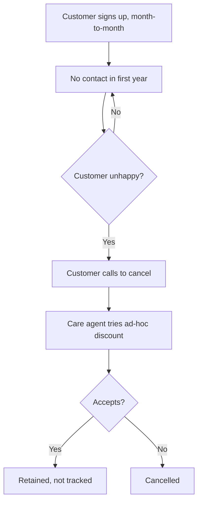
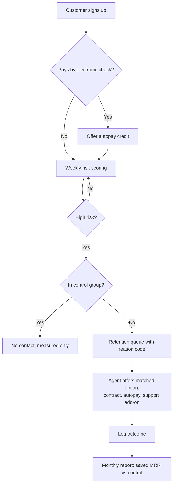

# Process Maps

## As-is: reactive retention

```mermaid
flowchart TD
    A[Customer signs up, month-to-month] --> B[No contact in first year]
    B --> C{Customer unhappy?}
    C -- No --> B
    C -- Yes --> D[Customer calls to cancel]
    D --> E[Care agent tries ad-hoc discount]
    E --> F{Accepts?}
    F -- Yes --> G[Retained, not tracked]
    F -- No --> H[Cancelled]
```

## To-be: proactive early-life retention

```mermaid
flowchart TD
    A[Customer signs up] --> B{Pays by electronic check?}
    B -- Yes --> C[Offer autopay credit]
    B -- No --> D[Weekly risk scoring]
    C --> D
    D --> E{High risk?}
    E -- No --> D
    E -- Yes --> F{In control group?}
    F -- Yes --> G[No contact, measured only]
    F -- No --> H[Retention queue with reason code]
    H --> I[Agent offers matched option:\ncontract, autopay, support add-on]
    I --> J[Log outcome]
    J --> K[Monthly report: saved MRR vs control]
```
